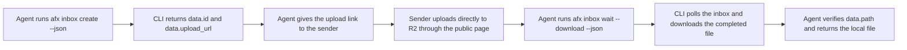

# Agent File Exchange

[中文说明](README.zh-CN.md)


Agent File Exchange (AFX) is a temporary file exchange service for automated agents. It runs on Cloudflare Workers, stores metadata in D1, stores file bodies in R2, and includes a Go CLI.

## Features

- Send a file and create a temporary public download URL with expiration, download limits, or burn-after-read semantics.
- Create a one-time inbox URL for a human or external system, then wait for and download the received file.
- Upload file bodies directly to R2. The Worker signs a short-lived staging URL, verifies the object, and publishes it to an immutable final key with CopyObject.
- Isolate tenants by API key, with a separate Root API key for global administration.
- Store only HMAC digests of public capability tokens and redact secrets from audit events.
- Serve public pages in English and Simplified Chinese from separate locale resources.

## Architecture

```text
afx CLI / agent ── metadata API ──> Cloudflare Worker ──> D1
       │                                      │
       └── signed PUT ───────────────────────> R2 staging object
                                              │ verify + CopyObject
                                              └────────> R2 final object

public recipient ── capability URL ─────────> download or one-time inbox page
```

The Worker never proxies upload bodies. A signed URL can only write to a staging key; completion verifies size and metadata before copying to the final key, so an old upload URL cannot overwrite a published file.

## Agent workflows

### Share a file

```mermaid
flowchart LR
  S1["Agent selects an authorized local file"] --> S2["Run afx upload --json"]
  S2 --> S3["Worker creates a short-lived upload session"]
  S3 --> S4["CLI uploads directly to an R2 staging object"]
  S4 --> S5["Worker verifies and publishes the final object"]
  S5 --> S6["CLI returns data.url"]
  S6 --> S7["Agent gives the temporary link to the recipient"]
  S7 --> S8["Recipient downloads the file"]
```



### Receive a file



## Repository layout

```text
worker/   Cloudflare Worker (TypeScript, Hono, D1, R2)
cli/      afx CLI (Go, Cobra; English interface)
skills/   Installable Agent Skills and bundled scripts
docs/     API, security, operations, and social assets
design/   Implementation plan and design decisions
```

## Quick start

### 1. Prepare Cloudflare resources

Generate a Root API key and its HMAC hash offline. Replace the pepper placeholder with the same secret you will configure as `ROOT_API_KEY_PEPPER`:

```bash
node -e "const c=require('crypto');const s=c.randomBytes(32).toString('base64url');console.log('ROOT_KEY=afx_root_'+s);console.log('ROOT_API_KEY_HASH='+c.createHmac('sha256','<ROOT_API_KEY_PEPPER>').update(s).digest('hex'))"
```

Then create D1 and R2, configure `worker/wrangler.jsonc`, set secrets, apply the initial schema, and deploy:

```bash
cd worker
npm install
npx wrangler d1 create agent-file-exchange
npx wrangler r2 bucket create agent-file-exchange

# Fill in the D1 database ID, R2 account/bucket values, and PUBLIC_BASE_URL.
# Replace the example origin in r2-cors.example.json with PUBLIC_BASE_URL.
npx wrangler secret put ROOT_API_KEY_HASH
npx wrangler secret put ROOT_API_KEY_PEPPER
npx wrangler secret put API_KEY_PEPPER
npx wrangler secret put TOKEN_HASH_PEPPER
npx wrangler secret put IP_HASH_PEPPER
npx wrangler secret put R2_ACCESS_KEY_ID
npx wrangler secret put R2_SECRET_ACCESS_KEY
npx wrangler r2 bucket cors set agent-file-exchange --file r2-cors.example.json
npx wrangler d1 migrations apply agent-file-exchange --remote
npx wrangler deploy
```

Apply every migration in `worker/migrations/` in order. Wrangler records completed migrations and applies only pending files.

#### Store the Root API key after deployment

Cloudflare stores only `ROOT_API_KEY_HASH`; it cannot recover the plaintext Root API key. Immediately after deployment:

1. Save the Root API key in a durable, cross-device password manager as `AFX Root API Key — <endpoint>`. Record the canonical HTTPS endpoint without a trailing slash and the creation date. This is the recovery copy.
2. On each administration machine, add an operational copy to the OS credential store using the standard locator below. Do not make this device-local copy the only copy.
3. Never store the Root API key in the repository, `config.toml`, `.env`, `.dev.vars`, shell startup files or history, chat, or a plaintext file—even when that file is Git-ignored. Do not pass it through `--root-key`.

Use `dev.qiankun.afx.root-api-key` as the service or secret name and the canonical endpoint as its account or lookup key:

**macOS Keychain**

```bash
export AFX_ENDPOINT=https://files.example.com
security add-generic-password -U \
  -s dev.qiankun.afx.root-api-key \
  -a "$AFX_ENDPOINT" \
  -l "AFX Root API Key ($AFX_ENDPOINT)" \
  -w
```

Keep `-w` last so Keychain prompts without placing the secret in command history.

**Linux Secret Service** (`secret-tool`)

```bash
export AFX_ENDPOINT=https://files.example.com
secret-tool store \
  --label="AFX Root API Key ($AFX_ENDPOINT)" \
  application afx credential root-api-key endpoint "$AFX_ENDPOINT"
```

Run it from a terminal so Secret Service prompts for the value.

**Windows PowerShell SecretManagement** (with a registered default vault)

```powershell
$env:AFX_ENDPOINT = 'https://files.example.com'
Set-Secret -Name "dev.qiankun.afx.root-api-key::$env:AFX_ENDPOINT"
```

`Set-Secret` prompts for a `SecureString` when the value is omitted. A password-manager-backed SecretManagement vault is preferred when one is available.

For an explicitly authorized administration command, retrieve the key only for that process and then clear it. For example, on macOS:

```bash
AFX_ROOT_API_KEY="$(security find-generic-password \
  -s dev.qiankun.afx.root-api-key \
  -a "$AFX_ENDPOINT" \
  -w)" afx admin stats --json
```

The Agent Skill below defines the equivalent Linux and Windows lookup rules. If the recovery copy or OS credential-store record cannot be read, stop; do not search files or rotate the Root key automatically.

### 2. Build and use the CLI

Install the latest macOS or Linux release with checksum verification:

```bash
installer="$(mktemp)"
curl -fsSL https://raw.githubusercontent.com/brookqin/afx/main/skills/agent-file-exchange/scripts/install-cli.sh -o "$installer"
sh "$installer"
rm "$installer"
afx version
```

Alternatively, build from source:

```bash
make build
export AFX_ENDPOINT=https://files.example.com
export AFX_API_KEY=afx_...

./cli/afx status --json

./cli/afx upload report.pdf --description "Quarterly report" --expires 24h --json
./cli/afx inbox create --expires 1h --title "Upload logs" --json
./cli/afx inbox wait <inbox-id> --timeout 1h --download --output . --json
```

Run `./cli/afx --help` for the full English command reference.

`afx status --json` reports the resolved endpoint and configuration sources without exposing keys. It verifies service connectivity when no tenant key is configured and validates the key through the scope-independent authenticated status endpoint when one is present.

The CLI does not generate or migrate its persistent configuration. Create `dev.qiankun.afx/config.toml` manually under the platform user configuration directory: `$HOME/Library/Application Support` on macOS, `$XDG_CONFIG_HOME` (or `$HOME/.config`) on Linux, and `%AppData%` on Windows. `data.config.config_file` from `afx status --json` reports the exact path. This is a breaking path: earlier `afx/config.toml` and `~/.config/afx/config.toml` locations are not read.

Pushing a semantic version tag such as `v1.2.3` runs the CLI release workflow. It tests and publishes Linux, macOS, and Windows archives for amd64 and arm64 together with `checksums.txt`.

### 3. Develop and test

```bash
make test
make typecheck
make build
```

For local Worker development, configure local D1/R2 bindings and run `make worker-dev`.

## Internationalization

Public Worker pages support English (`en`) and Simplified Chinese (`zh-CN`). Locale selection uses this order:

1. `?lang=en` or `?lang=zh-CN`
2. the weighted `Accept-Language` header
3. Simplified Chinese as the fallback

Language resources live in `worker/src/locales/en.ts` and `worker/src/locales/zh-CN.ts`. API error codes and JSON response shapes remain language-neutral and stable. The CLI intentionally stays English-only.

## Security model

- Public URLs contain 32-byte high-entropy capability tokens; D1 stores only HMAC-SHA-256 digests.
- Conditional D1 updates atomically enforce download counts, burn-after-read, and one-time upload leases.
- Original filenames never appear in R2 object keys.
- Direct-upload URLs expire quickly and cannot target final object keys.
- Audit events exclude complete tokens, API keys, secrets, and file content; client IPs are HMAC-pseudonymized with daily rotation.

See [Security](docs/SECURITY.md) before production use.

## Documentation

- [API reference](docs/API.md)
- [Operations guide](docs/OPERATIONS.md)
- [Security model](docs/SECURITY.md)
- [Agent Skill](skills/agent-file-exchange/SKILL.md)
- [Implementation plan](design/agent-file-exchange-implementation-plan.md)

## License

Licensed under the [MIT License](LICENSE).
