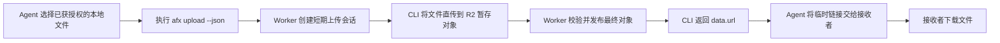
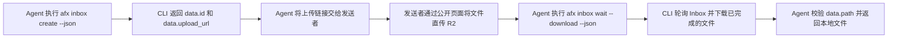

# Agent File Exchange

[English README](README.md)


Agent File Exchange（AFX）是一个面向自动化 Agent 的临时文件交换服务。它运行在 Cloudflare Workers 上，使用 D1 保存元数据、R2 保存文件本体，并提供 Go CLI。

## 功能

- 发送文件并生成临时公开下载链接，支持有效期、最大下载次数和阅后即焚。
- 创建一次性接收链接，交给用户或外部系统上传文件，Agent 可轮询并下载结果。
- 文件正文直接上传 R2：Worker 签发短期暂存 URL，校验对象后通过 CopyObject 发布到不可变的最终 Key。
- 普通 API Key 之间按租户隔离，Root API Key 用于全局管理。
- 公开 Capability Token 只保存 HMAC 摘要，审计记录不写入敏感信息。
- 公开网页支持英文和简体中文，且不同语言使用独立资源文件。

## 架构

```text
afx CLI / Agent ── 元数据 API ──> Cloudflare Worker ──> D1
       │                                      │
       └── 签名 PUT ─────────────────────────> R2 暂存对象
                                              │ 校验 + CopyObject
                                              └────────> R2 最终对象

公开访问者 ── Capability URL ────────────────> 下载页或一次性接收页
```

Worker 不代理上传文件正文。签名 URL 只能写暂存 Key；完成接口校验大小和元数据后才复制到最终 Key，因此旧上传 URL 无法覆盖已经发布的文件。

## Agent 使用流程

### 分享文件



### 接收文件



## 目录结构

```text
worker/   Cloudflare Worker（TypeScript、Hono、D1、R2）
cli/      afx CLI（Go、Cobra，界面保持英文）
skills/   可安装的 Agent Skill 与配套脚本
docs/     API、安全、运维文档与图片资源
design/   实现计划与设计决策
```

## 快速开始

### 1. 准备 Cloudflare 资源

先离线生成 Root API Key 和 HMAC Hash。下面的 Pepper 必须与后续配置的 `ROOT_API_KEY_PEPPER` 一致：

```bash
node -e "const c=require('crypto');const s=c.randomBytes(32).toString('base64url');console.log('ROOT_KEY=afx_root_'+s);console.log('ROOT_API_KEY_HASH='+c.createHmac('sha256','<你的ROOT_API_KEY_PEPPER>').update(s).digest('hex'))"
```

然后创建 D1 和 R2、配置 `worker/wrangler.jsonc`、写入 Secrets、应用初始化结构并部署：

```bash
cd worker
npm install
npx wrangler d1 create agent-file-exchange
npx wrangler r2 bucket create agent-file-exchange

# 填写 D1 database_id、R2 账号/桶信息和 PUBLIC_BASE_URL。
# 将 r2-cors.example.json 中的示例域名替换为 PUBLIC_BASE_URL。
npx wrangler secret put ROOT_API_KEY_HASH
npx wrangler secret put ROOT_API_KEY_PEPPER
npx wrangler secret put API_KEY_PEPPER
npx wrangler secret put TOKEN_HASH_PEPPER
npx wrangler secret put IP_HASH_PEPPER
npx wrangler secret put R2_ACCESS_KEY_ID
npx wrangler secret put R2_SECRET_ACCESS_KEY
npx wrangler r2 bucket cors set agent-file-exchange --file r2-cors.example.json
npx wrangler d1 migrations apply agent-file-exchange --remote
npx wrangler deploy
```

按顺序应用 `worker/migrations/` 中的全部 Migration；Wrangler 会记录已完成项并只执行待应用文件。

#### 部署成功后保存 Root API Key

Cloudflare 只保存 `ROOT_API_KEY_HASH`，无法恢复 Root API Key 明文。部署成功后应立即完成以下操作：

1. 在支持跨设备同步和恢复的密码管理器中保存 Root API Key，条目名称统一为 `AFX Root API Key — <endpoint>`，并记录不带末尾 `/` 的规范 HTTPS Endpoint 与创建日期。它是恢复副本。
2. 在每台管理机器上，将操作副本写入系统凭据库，并使用下述统一定位规则。不要把单台设备上的副本作为唯一备份。
3. 不要把 Root API Key 放进仓库、`config.toml`、`.env`、`.dev.vars`、Shell 启动文件或历史、聊天消息、任何明文文件；即使文件已被 Git 忽略也不安全。不要通过 `--root-key` 传入。

统一使用 `dev.qiankun.afx.root-api-key` 作为服务或 Secret 名称，并用规范 Endpoint 作为账号或查询键：

**macOS Keychain**

```bash
export AFX_ENDPOINT=https://files.example.com
security add-generic-password -U \
  -s dev.qiankun.afx.root-api-key \
  -a "$AFX_ENDPOINT" \
  -l "AFX Root API Key ($AFX_ENDPOINT)" \
  -w
```

把 `-w` 放在命令末尾，让 Keychain 安全提示输入，避免密钥进入命令历史。

**Linux Secret Service**（`secret-tool`）

```bash
export AFX_ENDPOINT=https://files.example.com
secret-tool store \
  --label="AFX Root API Key ($AFX_ENDPOINT)" \
  application afx credential root-api-key endpoint "$AFX_ENDPOINT"
```

应在终端中运行，让 Secret Service 提示输入密钥。

**Windows PowerShell SecretManagement**（已注册默认 Vault）

```powershell
$env:AFX_ENDPOINT = 'https://files.example.com'
Set-Secret -Name "dev.qiankun.afx.root-api-key::$env:AFX_ENDPOINT"
```

省略值时，`Set-Secret` 会提示输入 `SecureString`。如果已有密码管理器提供的 SecretManagement Vault，应优先使用它。

只有在用户明确授权管理操作时，才为单个进程取出 Root Key，并在操作后清理。例如 macOS：

```bash
AFX_ROOT_API_KEY="$(security find-generic-password \
  -s dev.qiankun.afx.root-api-key \
  -a "$AFX_ENDPOINT" \
  -w)" afx admin stats --json
```

下方 Agent Skill 定义了 Linux 与 Windows 的等价读取规则。无法读取恢复副本或系统凭据库记录时应停止，不要搜索文件，也不要自动轮换 Root Key。

### 2. 构建和使用 CLI

macOS 或 Linux 可自动安装最新 Release，并校验 SHA-256：

```bash
installer="$(mktemp)"
curl -fsSL https://raw.githubusercontent.com/brookqin/afx/main/skills/agent-file-exchange/scripts/install-cli.sh -o "$installer"
sh "$installer"
rm "$installer"
afx version
```

也可以从源码构建：

```bash
make build
export AFX_ENDPOINT=https://files.example.com
export AFX_API_KEY=afx_...

printf '%s' "$AFX_API_KEY" | \
  ./cli/afx config set --endpoint "$AFX_ENDPOINT" --api-key-stdin --json
unset AFX_API_KEY

./cli/afx status --json

./cli/afx upload report.pdf --description "季度报告" --expires 24h --json
./cli/afx inbox create --expires 1h --title "Upload logs" --json
./cli/afx inbox wait <inbox-id> --timeout 1h --download --output . --json
```

运行 `./cli/afx --help` 查看完整英文命令说明。

`afx config set` 用于创建或更新持久配置。`--api-key-stdin` 既接受普通 API Key 明文，也接受 `afx admin keys create --json` 的完整 JSON 输出；结果不会返回 Key。未提供的字段保持原值，因此 `afx config set --endpoint https://new.example.com --json` 只更新 Endpoint。Root Key 会被拒绝。macOS 与 Linux 上，命令强制目录权限为 `0700`、文件权限为 `0600`。

在 POSIX Shell 中把 `afx admin keys create --json` 管道传给 `config set` 时应启用 `pipefail`。如果 Key 已创建但配置写入失败，应先吊销未使用的租户 Key，再重试。

`afx status --json` 不显示任何密钥，只报告解析后的 Endpoint 与配置来源。未配置普通 Key 时检查服务连通性；配置 Key 后通过不依赖业务 Scope 的认证状态接口校验 Key 是否有效。

CLI 将持久配置写入平台用户配置目录下的 `dev.qiankun.afx/config.toml`：macOS 使用 `$HOME/Library/Application Support`，Linux 使用 `$XDG_CONFIG_HOME`（未设置时为 `$HOME/.config`），Windows 使用 `%AppData%`。`afx status --json` 的 `data.config.config_file` 会报告精确路径。这是 breaking 路径变更，旧的 `afx/config.toml` 与 `~/.config/afx/config.toml` 均不再读取或迁移。

推送 `v1.2.3` 这类语义化版本 Tag 后，CLI Release workflow 会自动测试并发布 Linux、macOS、Windows 的 amd64/arm64 压缩包及 `checksums.txt`。

### 3. 本地开发与测试

```bash
make test
make typecheck
make build
```

本地开发 Worker 时，请先配置本地 D1/R2 Binding，再运行 `make worker-dev`。

## 国际化

Worker 公开网页支持英文（`en`）和简体中文（`zh-CN`），语言选择顺序如下：

1. `?lang=en` 或 `?lang=zh-CN`
2. 带权重的 `Accept-Language` 请求头
3. 默认简体中文

语言资源分别位于 `worker/src/locales/en.ts` 和 `worker/src/locales/zh-CN.ts`。API 错误码与 JSON 响应结构保持稳定，不随语言变化。CLI 按要求保持纯英文。

## 安全模型

- 公开链接使用 32 字节高熵 Capability Token，D1 只保存 HMAC-SHA-256 摘要。
- D1 条件更新原子执行下载计数、阅后即焚和一次性上传租约。
- R2 Object Key 不包含原始文件名。
- 直传 URL 有较短有效期，并且不能写最终对象 Key。
- 审计记录不包含完整 Token、API Key、Secret 或文件正文；客户端 IP 使用按日轮换盐的 HMAC 做伪匿名化。

生产使用前请阅读[安全说明](docs/SECURITY.md)。

## 文档

- [API 参考](docs/API.md)
- [安全说明](docs/SECURITY.md)
- [运维手册](docs/OPERATIONS.md)
- [Agent Skill](skills/agent-file-exchange/SKILL.md)
- [实现计划](design/agent-file-exchange-implementation-plan.md)

## 开源协议

本项目使用 [MIT License](LICENSE)。
